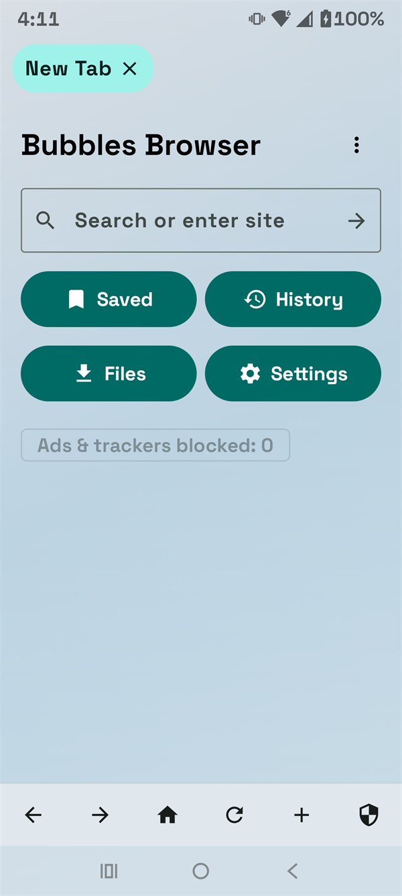

# Bubbles Browser for Android

Bubbles Browser is a private, AI-free web browser for Android phones and tablets. You can browse websites, save bookmarks, download files, play local music, and choose the privacy protections that work best for you.

## Download And Install

**[Download the newest APK from GitHub Releases](https://github.com/KernFerm/Bubbles-Browser-Android/releases/latest)**

1. On your Android device, open the download link above.
2. Under **Assets**, tap `Bubbles-Browser-Android-v0.6.70.apk`.
3. When the download finishes, tap the APK file.
4. If Android asks for permission, allow your browser or Files app to install unknown apps.
5. Tap **Install**, then tap **Open**.

Google Play Protect may warn that this app came from outside Google Play. That is expected for a GitHub APK. Confirm that the download came from this official repository before continuing.

Visit the **[Bubbles Browser website](https://kernferm.github.io/Bubbles-Browser-Android/)** for screenshots, a feature overview, and the same official download.

  

See the [screenshot gallery](https://kernferm.github.io/Bubbles-Browser-Android/screenshots/) to look around before installing. The [step-by-step installation guide](docs/INSTALLATION.md) includes additional help and APK verification instructions.

## What It Does

- Browse websites in multiple tabs with back, forward, home, reload, and new-tab controls.
- Search the web or enter a website address from the start page.
- Save bookmarks and review or clear browsing history.
- Download files through Android's system download service and receive completion notifications.
- Use separate standard, guest, child, work, and streaming profiles.
- Export and import local profile backups. Profile PINs are not included in backups.
- Block known advertising and tracking requests and show a session counter.
- Review separate ad, tracker, fingerprinting, URL-cleanup, malicious-request, cryptomining, and compatibility statistics in the Trust Center.
- Enable, disable, and update locally cached EasyList, EasyPrivacy, AdGuard, Peter Lowe, DuckDuckGo Tracker Radar, Fanboy, URLHaus, and NoCoin-compatible protection lists.
- Choose strict, balanced, or off modes for canvas and JavaScript fingerprint protection, plus recommended, strict, or off WebRTC privacy.
- Store website logins in Android Keystore-backed encrypted storage, generate strong passwords, and check saved passwords with Have I Been Pwned k-anonymity.
- Keep a user-controlled encrypted clipboard history; Android clipboard content is captured only when you press the save action.
- Apply local safe-browsing checks to websites and downloads.
- Open supported video, live TV, sports, creator, free, specialty, and audio services from the Streaming Hub, including full-screen HTML5 playback.
- Let secure websites request location for nearby restaurants, stores, and local search results after Android asks for permission.
- Play local audio with Android Media3 and download direct audio-file links after consent.
- Inspect tabs and memory information in the Task Manager and Diagnostics screens.
- Adjust large text, high contrast, reduced motion, dyslexia-friendly text, simplified UI, focus mode, reading ruler, battery saver, and background-tab behavior.

Bubbles Browser does not include Ollama, generative AI, telemetry, analytics, or cloud synchronization.

Enabled privacy lists are downloaded automatically when a fresh install has no local cache. Later updates can be requested from **Settings > Manage privacy lists**. Android WebView can enforce supported network and URL rules, but it cannot apply every desktop cosmetic-filter rule. The app reports only rules its Android engine can enforce.

## Requirements

- A phone or tablet running Android 10 or newer
- An internet connection
- An up-to-date Android System WebView, available through Google Play

Some websites and streaming providers may require their own account, subscription, DRM support, or official app.

## Updating

Download the newer APK from GitHub Releases and install it over the existing app. Do not uninstall the old version first. Your created profiles and enabled or disabled setting choices are stored locally and remain available after a normal in-place update. Back up important profile data before updating as an extra precaution.

## Permissions

- **Internet and network status:** load websites and detect connectivity.
- **Notifications:** report completed or failed downloads on supported Android versions.
- **Music and audio:** load local audio files into the music player. This permission is optional for normal browsing.
- **Location:** provide approximate or precise location to a secure website only after it requests access and Android displays a permission prompt. Background location is not requested.
- **Camera and microphone:** support trusted secure websites that provide calls or media capture. Android prompts before either permission is granted.

## Troubleshooting

### The APK Will Not Install

- Confirm the device runs Android 10 or newer.
- Allow installs from the app that opened the APK.
- Download the APK again if Android reports that the package is invalid.
- If Android reports a signature conflict, back up app data, uninstall the older differently signed build, and install the current release.

### A Website Will Not Load

- Check Wi-Fi or mobile data.
- Update Android System WebView through Google Play.
- Confirm the address is correct and begins with `https://` when possible.
- Temporarily disable ad and tracker blocking for compatibility testing.
- If a site breaks after enabling an optional privacy list, disable that list under **Settings > Manage privacy lists**, then reload the page.
- Websites use their mobile layouts by default. If a website works only in its desktop layout, enable **Desktop site** for that website from the browser menu or enable **Desktop mode** for every website in Settings.
- Some DRM-heavy streaming websites may require their provider's official Android app.

### Download Notifications Do Not Appear

- Open Android **Settings > Apps > Bubbles Browser > Notifications** and enable notifications.
- Check that battery restrictions are not preventing Android's Download Manager from finishing work.

### Music Is Missing

- Grant the Music and audio permission in Android app settings.
- Use **Pick audio files** to select files through Android's file picker.
- The downloader accepts direct audio-file URLs; it does not include the desktop `yt-dlp` extraction system.

### The Interface Is Too Large Or Too Small

Open **Settings** in Bubbles Browser and adjust Large text, Simplified browser UI, or other accessibility options. Android's system font-size setting also affects the interface.

## Privacy And Security

Browser data is stored locally on the device. Bubbles Browser does not provide cloud sync and does not send analytics or telemetry. Incognito and guest modes reduce locally retained browser records, but they do not hide network activity from websites, internet providers, employers, schools, or the device operating system.

Password breach checks send only the first five hexadecimal characters of a SHA-1 password hash to the Have I Been Pwned range API. The password and complete hash are not sent. WebRTC recommended mode uses relay-only connections and may affect calls when a site has no TURN relay; strict mode disables WebRTC.

See [SECURITY.md](SECURITY.md) for supported versions and private vulnerability reporting.

## Support

Email: **support.bubblesthedev.webbrowser@gmail.com**

For ordinary bugs, include the app version, Android version, device model, and steps that reproduce the problem. Remove private information from screenshots and logs.

## License

Copyright (c) 2026 BubblesTheDev. All rights reserved.

No open-source license has been declared for the Android repository. Source availability does not by itself grant permission to copy, modify, or redistribute the project. Any license file later published in the repository controls over this summary.
