# Bubbles Browser Android Screenshots

These screenshots provide a general tour of Bubbles Browser. Some screens may differ slightly from the latest release as the interface continues to improve. The gallery uses an empty demonstration profile and contains no personal browsing data, credentials, downloads, or clipboard contents.

## Browsing

| Start page | Website browsing |
| --- | --- |
|  | 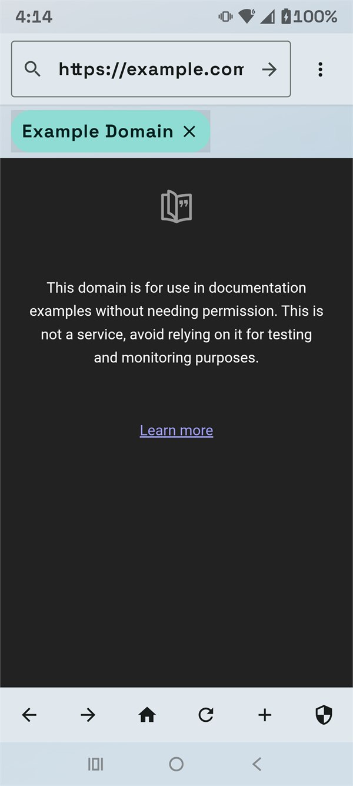 |

## Saved Content

| Bookmarks | History | Downloads |
| --- | --- | --- |
|  |  |  |

## Music

| Player and device audio | Direct audio downloads |
| --- | --- |
|  |  |

## Profiles And Settings

| Profiles | Settings overview |
| --- | --- |
|  |  |

| Privacy controls | Fingerprinting and WebRTC controls |
| --- | --- |
| 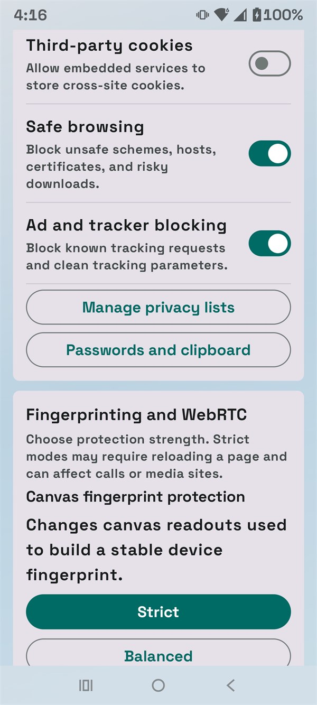 | 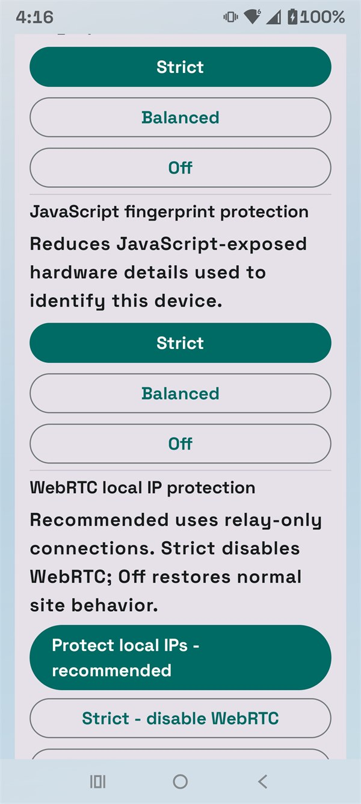 |

## Privacy Lists And Private Tools

| Privacy lists | Additional privacy lists |
| --- | --- |
| 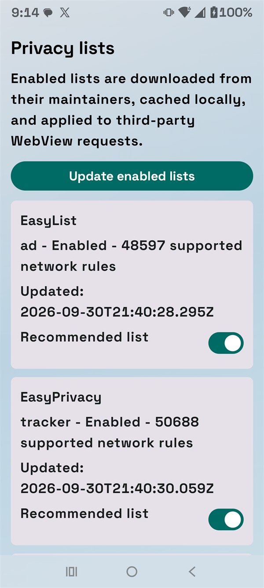 | 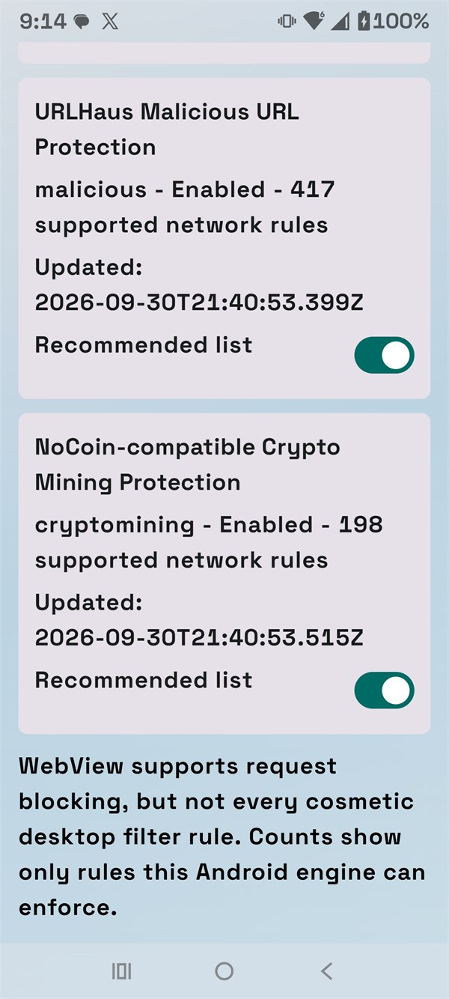 |

| Encrypted passwords | Clipboard controls |
| --- | --- |
| 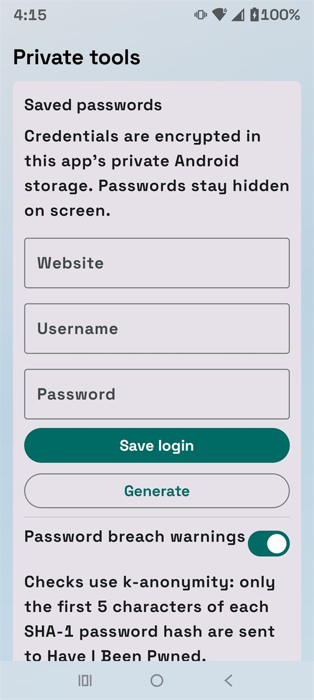 | 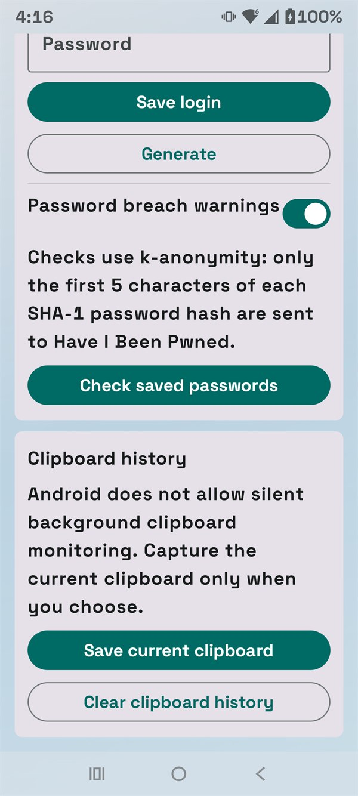 |

## Security And Performance

| Diagnostics | Privacy statistics |
| --- | --- |
| 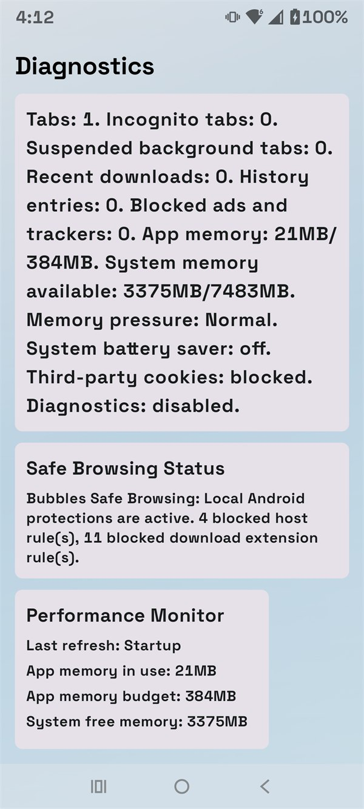 | 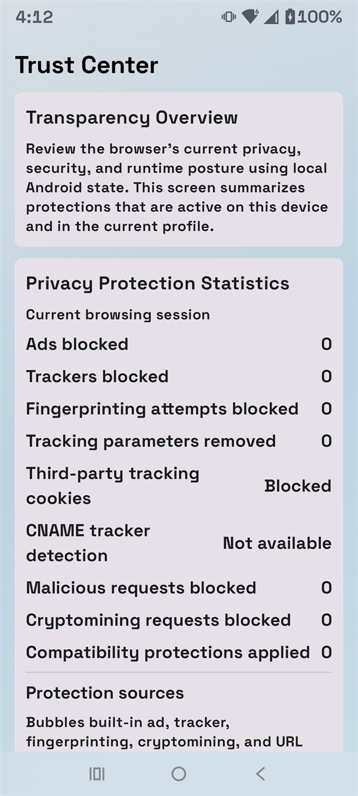 |

| Trust Center details | Task Manager |
| --- | --- |
| 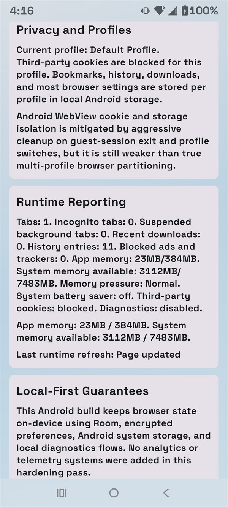 | 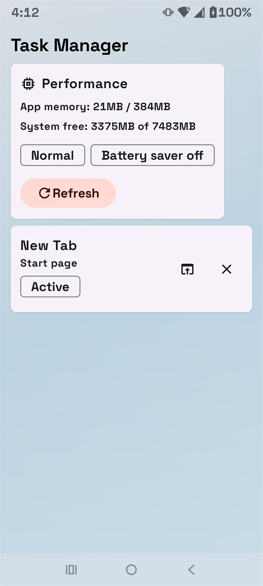 |

## Streaming

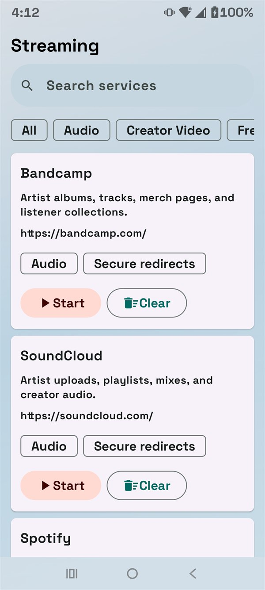

The Streaming Hub opens supported services in isolated streaming tabs with secure redirect handling. Playback, account access, and DRM availability still depend on Android System WebView and each provider.

## About

| Version and support | Release notes |
| --- | --- |
| 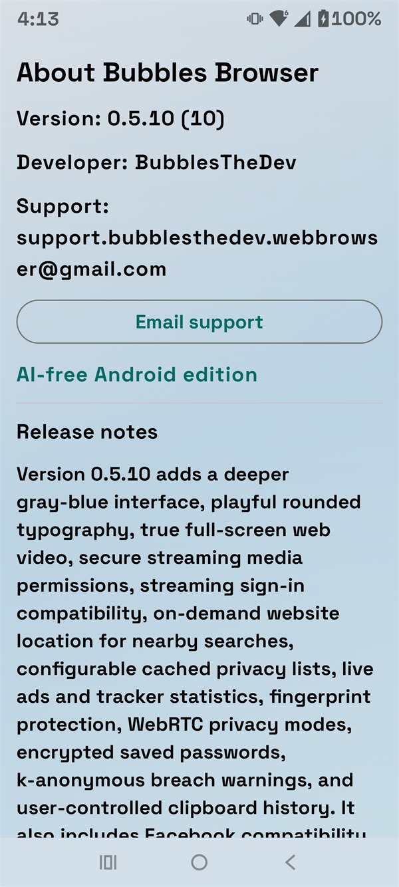 | 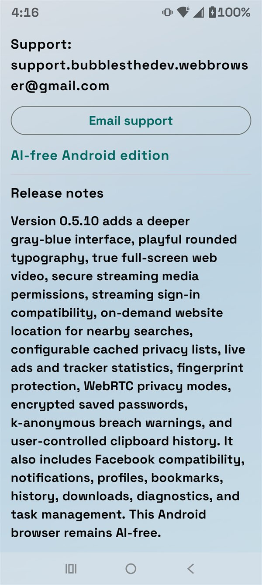 |
